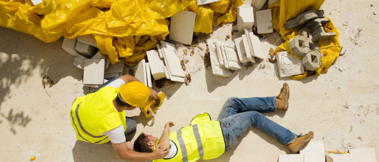

# NVIDIA JETSON PROJEC: WORKSITE SAFETY COMPLIANCE 


To better the safety of workers in worksites, here is an AI enabled solution to autonomously detection non-compliance cases using computer vision models and AI edge devices.

## Index

1. [Motivation](#1-motivation)
2. [Solution Overview](#2-solution-overview)
3. [Getting Started](#3-getting-started)
    1. [Hardware Requirement](#31-hardware-requirement)
    2. [Frameworks and Documentations](#32-frameworks-and-documentations)
    3. [Source Code and Model Weights](#33-source-code-and-model-weights)
    4. [PyTorch Installation for GPU Acceleration](#34-pytorch-installation-for-gpu-acceleration)


## 1. Motivation

In response to a surge in workplace accidents and fatalities post-Covid-19, this project aims to address the root causes. The increase is attributed in part to non-compliance with safety measures, particularly the ineffective management of Personal Protective Equipment (PPE) in worksites. Contributing factors include manpower shortages and tight deadlines resulting from the disruptions from the pandemic. The absence of adequate supervisors and safety monitoring systems leads to workers removing PPE under the hot and humid climate, elevating the risk of accidents. The project leverages deep learning and computer vision to automate PPE compliance monitoring, reducing the need for manual supervision. 



Source: https://www.hrmagazine.co.uk/content/news/work-related-fatalities-increased-in-2023/

Image: https://www.dxpe.com/how-workplace-injury-prevention-strategies-industrial-worksites/ 

Traditionally, the deployment of CCTV systems at construction sites has proven to be extremely challenging due to the dynamic nature of the construction work. It is often difficult to establish proper networking and relocate cameras as workers progress through different levels of the construction project. By utilizing Nvidia Jetson devices, it can improve solution mobility, enabling easy deployment and relocation at construction sites. This overcomes the physical limitations and cabling complexities associated with traditional CCTV systems and centralized servers.


## 2. Solution Overview

The solution empowers worksite supervisors to effortlessly deploy computer vision technology to ensure PPE compliance. Each standalone edge device can autonomously detect and log non-compliance instances, such as the removal of helmets, masks, and vests. This removes the need to transfer video data to a centralized server, offering increased mobility to move the devices between different stations as work progresses. For incident investigation purposes, each device is also capable of capturing a brief video of any non-compliant worker, enabling supervisors to retrieve information and arrange necessary corrective training. Here’s a diagram to visually illustrate a typical workflow.


Video demonstration [video_link](https://youtu.be/JdgpN0AOmts)

## 3. Getting Started

1x Jetson Orin Nano 8GB with Jetpack 5.1.2 (https://www.amazon.sg/NVIDIA-Jetson-Orin-Nano-Developer/dp/B0BZJTQ5YP  )
1x USB Camera (https://www.amazon.sg/Microphone-C960-Streaming-Computer-Conference/dp/B07M6Y7355/) 
1x MicroSD card 64GB (https://www.amazon.sg/SanDisk-Ultra-Memory-microSD-Card/dp/B08GYBBBBH) 
Movable camera stand (optional) 


### 3.1. Hardware Requirement

Here is the list of hardware used in this project:

- 1x Jetson Orin Nano 8GB with Jetpack 5.1.2 (https://www.amazon.sg/NVIDIA-Jetson-Orin-Nano-Developer/dp/B0BZJTQ5YP)
- 1x USB Camera (https://www.amazon.sg/Microphone-C960-Streaming-Computer-Conference/dp/B07M6Y7355/) 
- 1x MicroSD card 64GB (https://www.amazon.sg/SanDisk-Ultra-Memory-microSD-Card/dp/B08GYBBBBH) 
- Movable camera stand (optional) 
- USB Keyboard and Monitor for Jetson (optional)


### 3.2. Frameworks and Documentations

Here is the list of frameworks used in this project, please refer to the official documentations for more information. 

- JetPack SDK 5.1.2 (https://developer.nvidia.com/embedded/jetpack) 
- Python 3.9 (https://www.python.org/) 
- Django (https://www.djangoproject.com/) 
- PyTorch & torchvision (https://pytorch.org/) 
- YOLO (https://zenodo.org/records/7347926) 

### 3.3. Source Code and Model Weights

Clone the source code from my Github repository.

```sh
git clone https://github.com/liuyangData/jetson-django.git 
```

Download my model weights from my Google shared drive. 

- PPE Model: https://drive.google.com/file/d/12BIiKvTHTsRmfol-ITeioiCvMFPvszr5
- Person Model: https://drive.google.com/file/d/1ZMhjf_4eVBupHXy8VuBTrShifit34rTP
- Helmet Model: https://drive.google.com/file/d/1ZmuJmt0vS0isyLhlZG5phcFjHNPvpqP3

Move the three .pt files into the project weights folder at /jetson-django/yolo/weights/ 

### 3.4. PyTorch Installation for GPU Acceleration

Note that the instructions below are the JetPack 5.1.2 and Python 3.9. If you are using other versions, please check compatibility make necessary changes accordingly.

The default installation method on PyTorch's official website does not work on Jetson device - it will not read the GPU correctly. To overcome this, we have to download the offical build that is compability with jetpack. 

Install dependencies
```sh
pip install --upgrade pip; 
pip install aiohttp numpy=='1.19.4' scipy=='1.5.3'; 
pip install --upgrade protobuf;
```

Install PyTorch with GPU support on Jetpack
```sh 
pip install --no-cache https://developer.download.nvidia.com/compute/redist/jp/v502/pytorch/torch-1.13.0a0+d0d6b1f2.nv22.10-cp38-cp38-linux_aarch64.whl 
```

There is no pip installable version of torchvision that supports CUDA acceleration on Jetson devices. In order to take advantage of hardware acceleration, we have to build torchvision from source.

Install dependencies
```sh
sudo apt-get install libjpeg-dev zlib1g-dev libpython3-dev libopenblas-dev libavcodec-dev libavformat-dev libswscale-dev
```

Pull torchvision's source code 
```sh
git clone --branch v0.14.1 https://github.com/pytorch/vision torchvision
```

cd into torchvision source code folder
```sh
cd into torchvision folder 
```

build torchvision
```sh
export BUILD_VERSION=0.14.1 
```

```sh
python setup.py install --user
```


### 3.5. Pip install Python Dependencies

Install required libraries using pip

```sh
pip install -r ./requirements.txt
```

or install manually from the official website

- Django (https://www.djangoproject.com/ )
- OpenCV (https://opencv.org/) 
- Pandas  (https://pandas.pydata.org/) 
- PyYAML (https://yaml.org/ )
- Matplotlib (https://matplotlib.org/) 


### 3.6. Start and Configure Django

Starting the server 

```sh
python manage.py runserver 
```

Inspect the entrypoint from http://127.0.0.1:8000/. There should be 2 URL configurations
1. yolo
2. admin 

If faced with AttributeError: 'Upsample' object has no attribute 'recompute_scale_factor', follow this thread to resolve:
https://stackoverflow.com/questions/72297590/attributeerror-upsample-object-has-no-attribute-recompute-scale-factor 


Set up the local database
```sh
python manage.py migrate
```
The database used in this project is the default django SQLite database. This is a local database stored on the file db.sqlite3. Data may be accessed via the Django API for databases. Alternatively, for a graphical interface, open http://127.0.0.1:8000/ on a browser and log in via the superuser credentials created using python manage.py createsuperuser. 

```sh
python manage.py createsuperuser
```


## 4. Solution Explained

### 4.1. Demo APIs

There are some demo functionality available for quick testing. You may use your webcam, RTSP cameras, or the sample videos to test the models. Use the yolo/ URL pattern to navigate through different demos once the server is running. 
- For PPE detection using webcam, go to http://127.0.0.1:8000/stream 
- For PPE detection using your own RTSP, go to http://127.0.0.1:8000/<rtsp_url> 
- For helmet detection demo using sample videos, go to http://127.0.0.1:8000/helmet_detect /1 
- To try out with a different sample video, replace the last number in the URL with any number from 1 to 12. 

### 4.2. Custom Models Training


The Deep Learning models used in this project are trained on Google Colab to take advantage of its T4 GPU to accelerate training time. Two separate models are trained for this project
1. The first custom model is a helmet detector with two classes (helmet, and noHelmet)
2. The second custom model is a more comprehensive PPE detector with 6 classes (helmet, noHelmet, mask, noMask, vest, noVest). 
3. A pre-trained model (coco set) is also used as a person detector. 

All models are trained based on Ultralytics’ YOLO framework, using the YOLOv5x backbone (86.7 million parameters). Read more at: https://github.com/ultralytics/yolov5 

Training data has been collected from various publicly available videos on YouTube, of which most of the training videos has been gathered from the YouTube channel HospitalConstruction (https://www.youtube.com/@HospitalConstruction) 

The code and colab notebook can be found here for reference and custom training: https://colab.research.google.com/drive/1iDcTP_WlvlU3GLRw5fDvfkfKQO84Xm9D?usp=sharing


### 4.3. Multi-Stage Object Detection

The PPE detection model employs a two-stage process. The first stage uses a person detector to obtain bounding boxes for individuals in the frame. The second stage analyzes each person's PPE status within their bounding box, detecting items such as helmets, masks, and vests, as well as non-compliant cases such as, noHelmets, noMasks, and noVests.


This multi-stage approach minimizes misclassifications, ensuring, for example, that a helmet on a desk is not considered a compliance case. Furthermore, an additional check is included to ensure that the helmet is located on the head of the person, otherwise the person might be simply holding it instead of wearing it, and in such cases it will not be considered as compliant.  

### 4.4. Custom 'Person' Object

To enhance code structure and readability, a custom 'Person' object is created. Each 'Person' object retains a history of detections, enabling the development of a more sophisticated algorithm to analyze over multiple consecutive frames for improved accuracy. The compliant states of each person is managed independently and a person score is given to each person depending on his or her compliant level. 

Refer to the source code in yolo/view.py for implementation details.

### 4.5. Handling Uncertainties

You might be wondering, if there is a mask class as well as a person detector, why is there a need for a noMask class?  Non-compliant classes like 'noMask' are essential for handling uncertainties, especially when a worker's face is not clearly visible to the camera, this might create the wrong prediction that the person is not wearing a mask. Rather than forcing a label, the model is allowed to indicate uncertainty. If the camera angle does not allow the model to determine whether a person is wearing a mask or not, the model is allowed to maintain an 'uncertain' state (depicted using a gray icon with a question mark). Alerts are triggered only when the person turns to face the camera and a 'noMask' object is detected.


### 4.5. Confidence Status and Alerts

To reduce false positives, a confidence score is used to accumulate over consecutive frames. Violations are logged only when a certain number of consecutive detected violations is met across a certain time threshold. To prevent excessive alerts for prolonged non-compliance, a cooldown duration is also implemented for each 'Person' object before the next alert is sent.

Refer to the source code in yolo/view.py for implementation details.

### 4.6. Handling Video Output

Upon confirming non-compliance, the algorithm records a 10-second video, saving it locally as an mp4 file on the Jetson device. A screenshot of the incident will also be saved as a jpg file. This feature enables safety officers to periodically review and take remedial actions based on non-compliance videos.


## 5. Recommended Future Developments

1. Train additional models to expand use-cases 
2. Create a frontend web interface for system admin to update configuration 
3. Create better database management system to replace the default django Sqlite database
